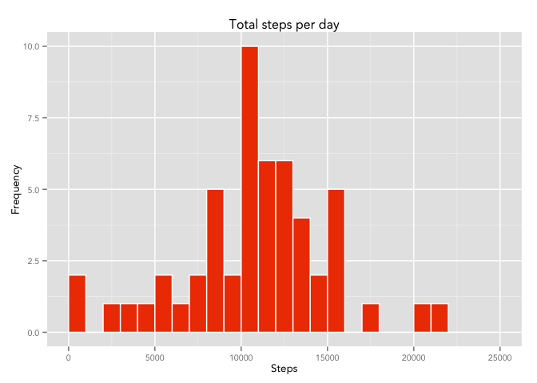
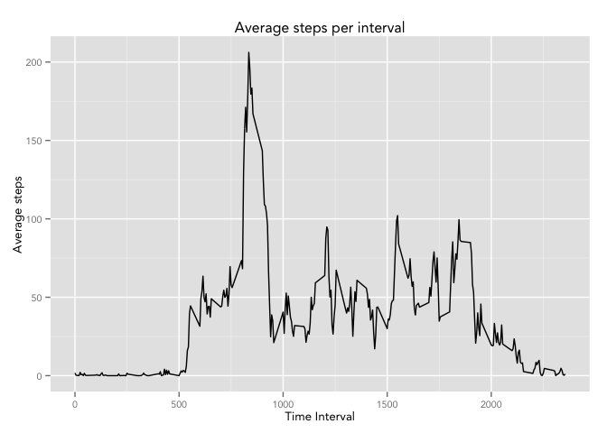
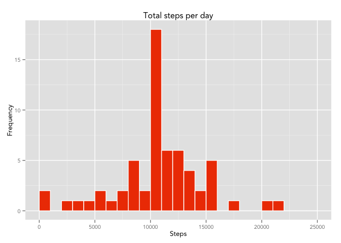
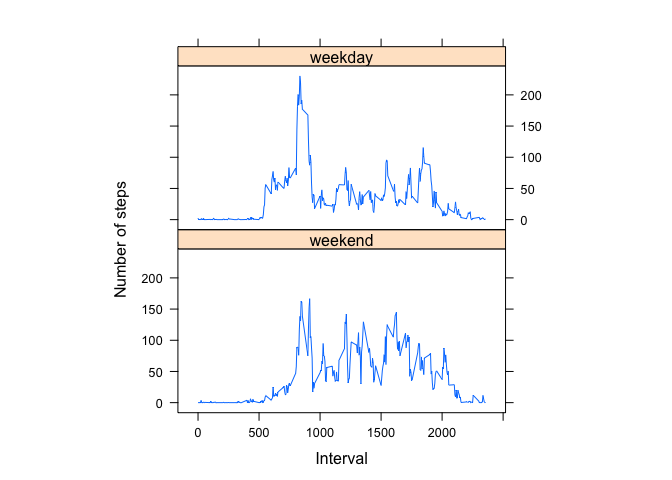

# Reproducible Research: Peer Assessment 1

##### Prepared 24 June 2015  

  
## Prepare Environment and Load Data  
1. Load required libraries  
  
  ```r
  library(reshape2)  
  library(dplyr)  
  library(ggplot2)  
  library(gridExtra)  
  library(lattice)  
  ```

2. Load and group data  
  
  ```r
  activity <- read.csv("activity.csv", stringsAsFactors = FALSE)  
  activityPlus <- activity  
  activity <- activity[complete.cases(activity), ]  
  ```

## What is the mean number of steps per day?  
1. Plot chart  
  
  ```r
  # Summarise by date  
  activityByDate <- group_by(activity, date)  
  activity_sumDate <- summarise(activityByDate, steps = sum(steps))  
  
  # Plot histogram  
  stepPlot <- ggplot(activity_sumDate, aes(steps)) +   
    geom_histogram(breaks = seq(0, 25000, 1000), col = "white", fill = "orangered2") +  
    labs(title = "Total steps per day", x = "Steps", y = "Frequency") +  
    theme(text = element_text(size = 10, family = "Avenir"))  
  stepPlot  
  ```
  
   

2. Find mean and median number of steps  
  
  ```r
  stepMean <- mean(activity_sumDate$steps)  
  stepMean  
  ```
  
  ```
  ## [1] 10766.19
  ```
  
  ```r
  stepMedian <- median(activity_sumDate$steps)  
  stepMedian  
  ```
  
  ```
  ## [1] 10765
  ```

## What is the average daily activity pattern?  
1. Time-series plot of average number steps taken per 5-minute interval  
  
  ```r
  # Summarise by time intervals  
  activityByTime <- group_by(activity, interval)  
  activity_sumTime <- summarise(activityByTime, steps = mean(steps))  
  
  # Plot time-series  
  stepPlotTime <- ggplot(activity_sumTime, aes(x = interval, y = steps)) +   
    geom_line() +   
    labs(title = "Average steps per interval", x = "Time Interval", y = "Average steps") +   
    theme(text = element_text(size = 10, family = "Avenir"))  
  stepPlotTime  
  ```
  
   
  
2. Find interval with maximum number of steps taken  
  
  ```r
  timeMax <- activity_sumTime[which.max(activity_sumTime$steps), ]$interval  
  timeMax  
  ```
  
  ```
  ## [1] 835
  ```
  
## Inputting missing values
1. Calculate and report number of missing values  
  
  ```r
  numberNA <- sum(is.na(activityPlus$step))  
  ```
  
2. Replace missing values in the dataset. The mean steps in each time interval is used here.  
  
  ```r
  for (i in 1:nrow(activityPlus)) {  
    if (is.na(activityPlus$steps[i])) {  
      activityPlus$steps[i] <- activity_sumTime[activity_sumTime$interval ==   activityPlus$interval[i], 2]  
    }  
  }  
  activityPlus$steps <- as.integer(activityPlus$steps)  
  ```
  
3. Plot histogram of altered data.  
  
  ```r
  # Summarise by date  
  activityByDatePlus <- group_by(activityPlus, date)  
  activity_sumDatePlus <- summarise(activityByDatePlus, steps = sum(steps))  
  
  # Plot histogram  
  stepPlotPlus <- ggplot(activity_sumDatePlus, aes(steps)) +   
    geom_histogram(breaks = seq(0, 25000, 1000), col = "white", fill =   "orangered2") +  
    labs(title = "Total steps per day", x = "Steps", y = "Frequency") +  
    theme(text = element_text(size = 10, family = "Avenir"))  
  stepPlotPlus  
  ```
  
   
  
4. Find mean and median with altered values 
  
  ```r
  stepMeanPlus <- mean(activity_sumDatePlus$steps)  
  stepMeanPlus  
  ```
  
  ```
  ## [1] 10749.77
  ```
  
  ```r
  stepMedianPlus <- median(activity_sumDatePlus$steps)  
  stepMedianPlus  
  ```
  
  ```
  ## [1] 10641
  ```
  
5. Find difference between mean and median of altered and unaltered values (altered minus unaltered)  
  
  ```r
  stepMeanDiff <- stepMeanPlus - stepMean  
  stepMeanDiff  
  ```
  
  ```
  ## [1] -16.41819
  ```
  
  ```r
  stepMedianDiff <- stepMedianPlus - stepMedian  
  stepMedianDiff  
  ```
  
  ```
  ## [1] -124
  ```
Both mean and median fell, but median fell by a larger extent.  
  
## Are there differences in activity patterns between weekdays and weekends?  
1. Create a new factor variable with two levels: "weekday" and "weekend."  
  
  ```r
  # Divide into weekday/weekend  
  activityPlus$day <- ifelse(as.POSIXlt(as.Date(activityPlus$date))$wday%%6 == 0, "weekend", "weekday")  
  activityPlus$day <- factor(activityPlus$day, levels = c("weekend", "weekday"))  
  activityPlusInt <- aggregate(steps ~ interval + day, data = activityPlus, FUN = mean)  
  ```
  
2. Plot for weekends and weekdays  
  
  ```r
  # Plot lattice plot  
  activityPlusPlot <- xyplot(steps ~ interval | factor(day), data =   activityPlusInt, aspect = 1/2, type = "l", ylab = "Number of steps", xlab = "Interval")  
  activityPlusPlot  
  ```
  
   

The plot shows that steps taken during weekends are more steady. Steps taken during weekdays show a large spike in the morning.  
